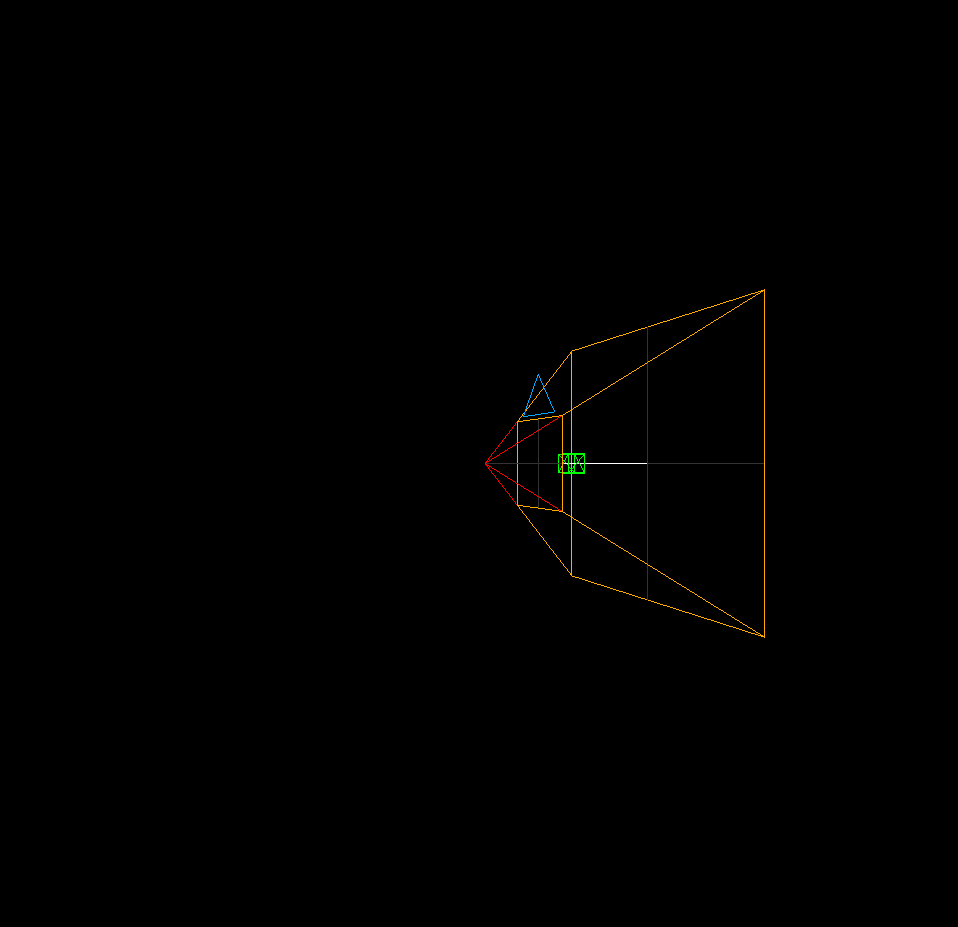
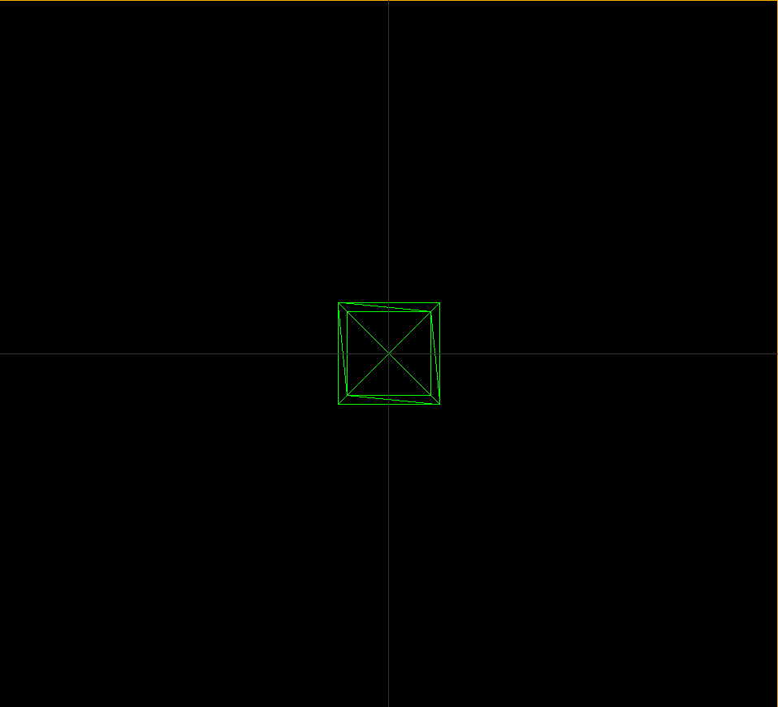
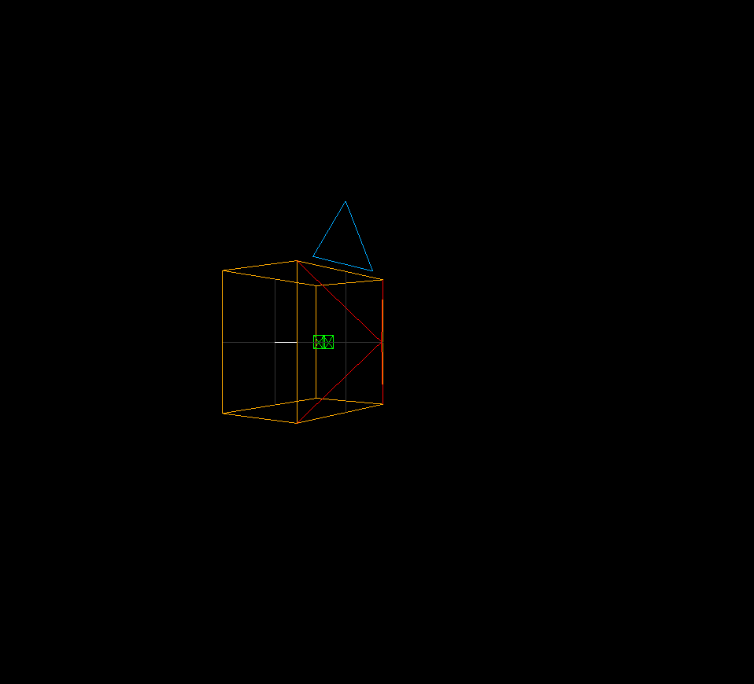
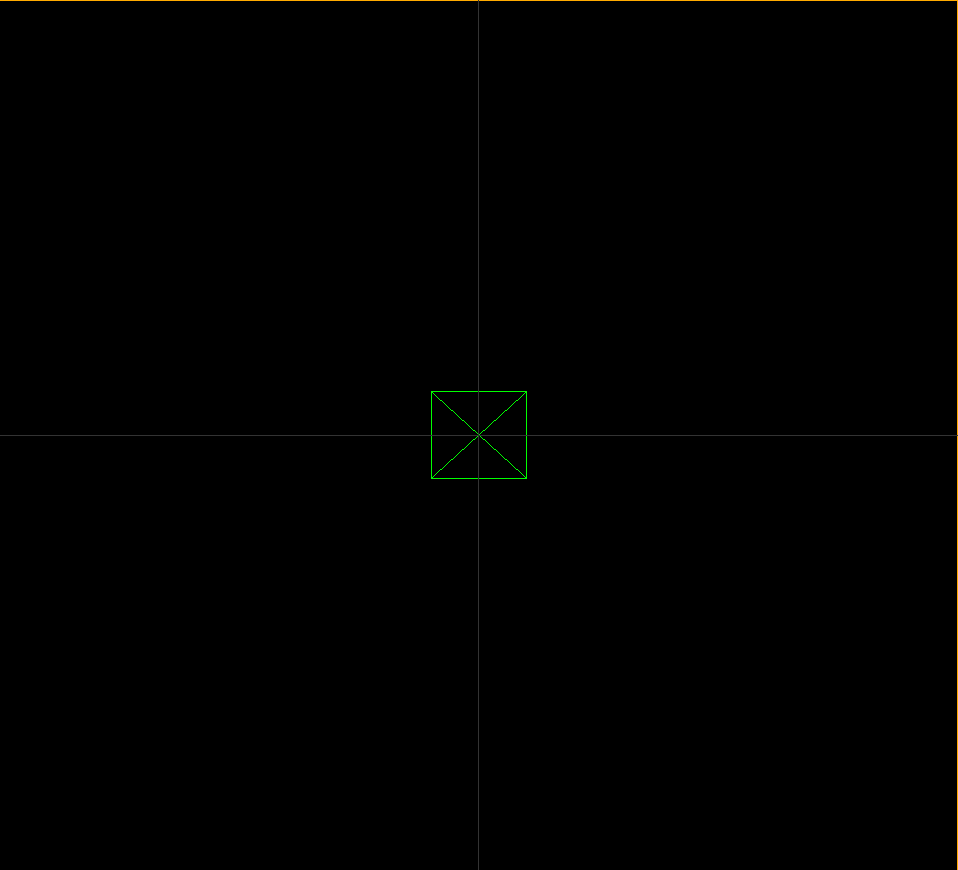

# Camera - how does it work? | Three.js

- Let's see the whole scene.
- Let's take the newly created camera view as a helper.

## PerspectiveCamera

This projection mode is designed to mimic the way the human eye sees. It is the most common projection mode used for rendering a 3D scene.

## OrthographicCamera

In this projection mode, an object's size in the rendered image stays constant regardless of its distance from the camera. This can be useful for rendering 2D scenes and UI elements, amongst other things.

