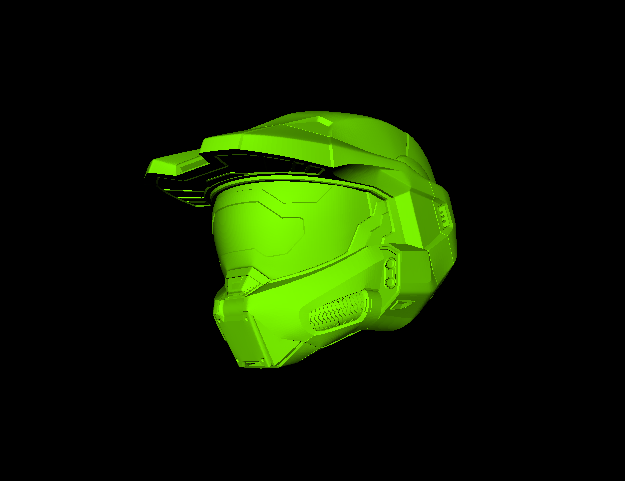

# Node.js | Three.js | STL Loader

Working with STL Loader.
How can we import '.stl' files?

##

## Node.js

`bash npm init -y `

## Express

`bash npm i express `

## Nodemon

`npm i nodemon -D`

## package.json

`bash scripts {"start": "nodemon app.js"} `
