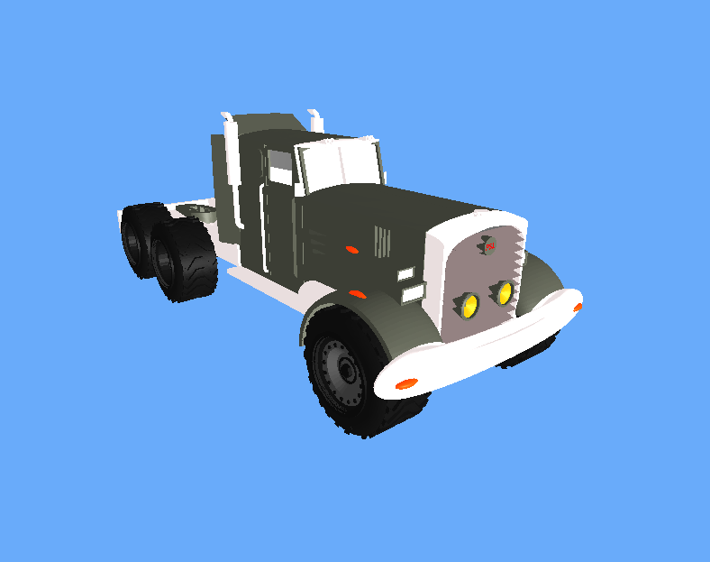

# Node.js | Three.js | 3MF Loader

Working with 3MF Loader.
How can we import '.3mf' files?

##

## Node.js

`npm init -y `

## Express

`npm i express `

## Nodemon

`npm i nodemon -D`

## package.json

`scripts {"start": "nodemon app.js"} `
